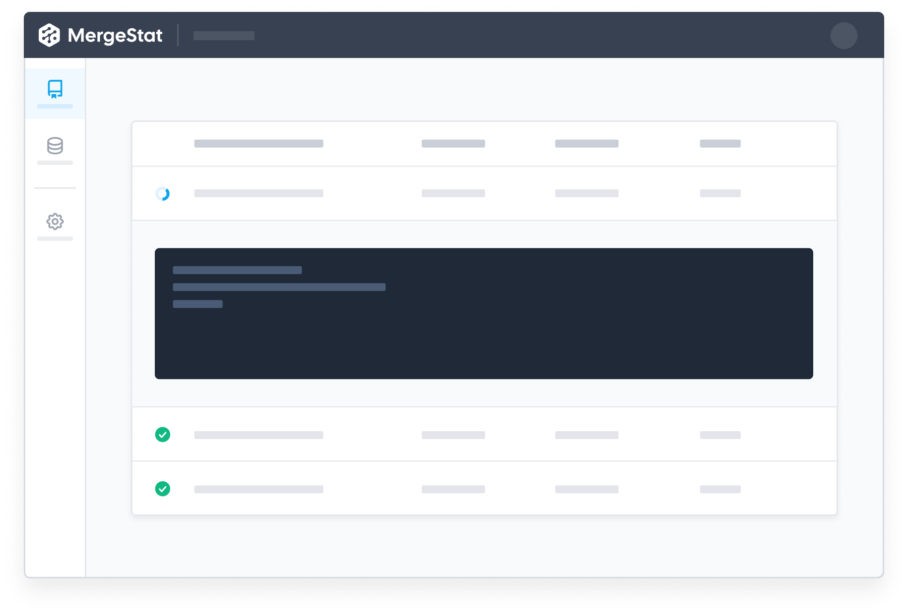
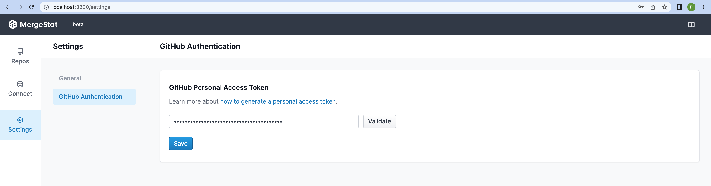
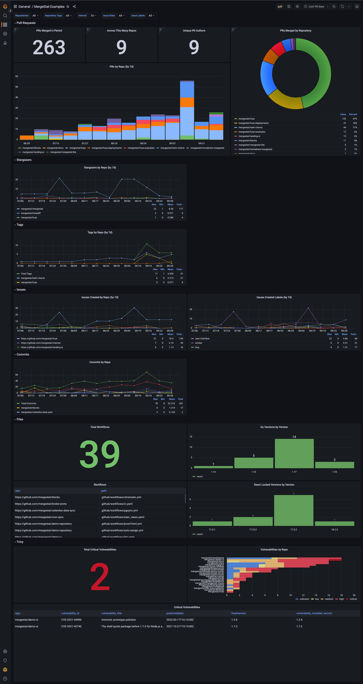

[](https://goreportcard.com/report/github.com/mergestat/mergestat)
[](https://github.com/mergestat/mergestat/actions/workflows/ci-worker.yaml)
[](https://github.com/mergestat/mergestat/actions/workflows/ci-frontend.yaml)
[](https://twitter.com/mergestat)
[](https://join.slack.com/t/mergestatcommunity/shared_invite/zt-xvvtvcz9-w3JJVIdhLgEWrVrKKNXOYg)

# mergestat <a href="https://docs.mergestat.com/"></a>

MergeStat enables SQL queries for data in git repositories (and related sources, such as the GitHub API). It allows you to ask questions about the history and contents of your source code.

**If you are looking for our CLI, which runs SQL queries against local git repositories, it's now called [`mergestat-lite`](https://github.com/mergestat/mergestat-lite)**

See our [**documentation**](https://docs.mergestat.com/) for additional context.



## Running Locally

Try MergeStat locally with `docker-compose` by cloning this repository and running

```sh
docker-compose up
```

Now if you visit `http://localhost:3300/` you should be able to access our management UI where you can begin adding repositories and syncing data.

**NOTE** if you'd like to make use of GitHub API data (any sync type that uses the GitHub API **including repo auto imports**) or any private GitHub repos you will need to supply a GitHub [personal access token](https://docs.github.com/en/authentication/keeping-your-account-and-data-secure/creating-a-personal-access-token).
We are working on GitHub auth alternatives, but for now a PAT is your best bet.



You can manage a single PAT for your instance in the `Settings` area of the management UI.

## Examples

Take a look at all of our [examples](./examples/examples.md)

You can also visit `http://localhost:3000/` to access a local [Grafana](https://grafana.com/) instance with example dashboards using the data from MergeStat 🎉 :



### Resetting a Local Instance

If you'd like to "start from scratch" (i.e. reset the DB and start with a fresh deployment), run the following:

```
docker-compose down
```

```
docker volume rm fuse_db_data
```
