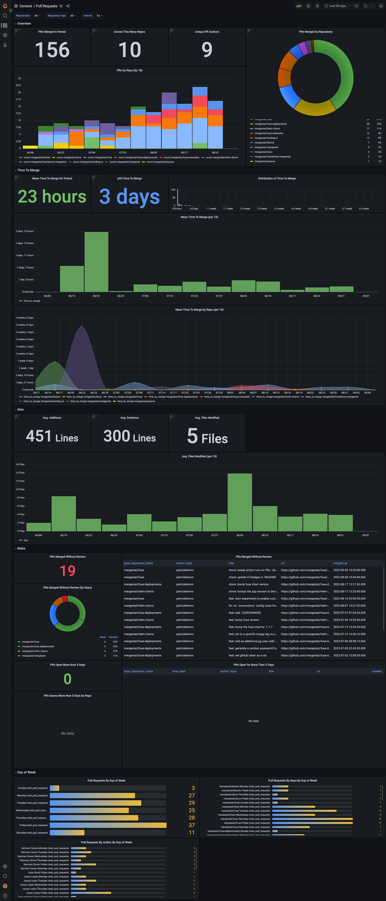

# MergeStat Examples

Examples are saved in a "Source" and "Topic" directory structure, with different types of examples.

    |-- source
        |-- topic
            |-- example-type
                |-- screenshots
                    |-- example-screenshot.png    
                |-- example-file.ext

We will be constantly working on adding more content.
For now, here is the current state of what we are working on and some of the roadmap items we have:

- SQL (_in progress_)
- Grafana (_in progress_)
- Metabase (_roadmap_)
- Apache Superset (_roadmap_)

## GitHub Pull Requests Grafana Example Screenshot

